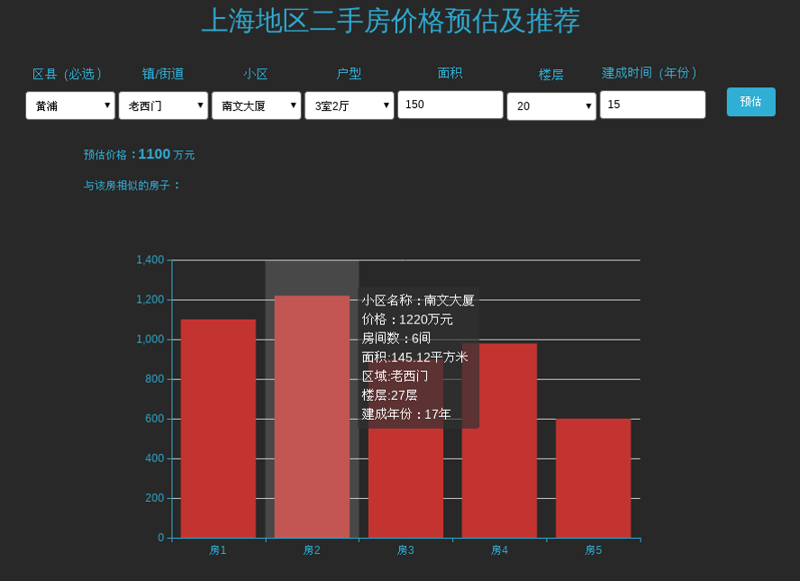

# Price-prediction-and-recommendation-of-second-hand-housing-in-Shanghai
Price prediction and recommendation of second-hand housing in Shanghai（上海地区二手房价格预测及推荐）

先上系统运行的截图：

1、本系统为本人读研数据课课程project。

2、本系统主要功能：爬取链家上海地区二手房信息，使用postgresql的机器学习库MADlib，采用KNN算法对用户输入的需求信息预测房价及推荐五个相似房源。

**本系统web显示界面在好友蒋雯协助下完成，其他工作由我完成。**

----

**database_project：**

该部分主要是完成链接网上海地区二手房数据的爬取和预处理，其中：

crawler.py 为爬虫代码

preprocess.py 为预处理代码

lianjia1.txt为爬取的原始数据，共42084条，数据样例为：

