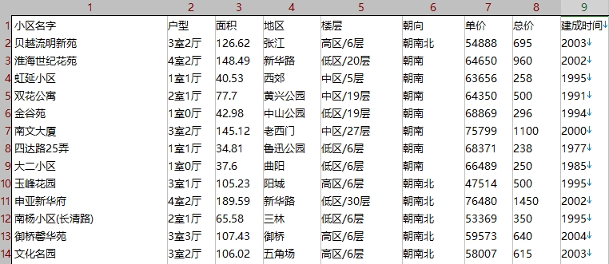

# Price-prediction-and-recommendation-of-second-hand-housing-in-Shanghai
Price prediction and recommendation of second-hand housing in Shanghai（上海地区二手房价格预测及推荐）

先上系统运行的截图：


1、本系统为本人读研数据课课程project。

2、本系统主要功能：爬取链家上海地区二手房信息，使用postgresql的机器学习库MADlib，采用KNN算法对用户输入的需求信息预测房价及推荐五个相似房源。

3、开发环境：centos7 64位、PostgreSQL9.5、MadLib1.13、pgAdmin4.2、Python2.7（web部分）、python3.6（数据爬取及处理部分）

**本系统web显示界面在好友蒋雯协助下完成，其他工作由我完成。**

----

**database_project：**

该部分主要是完成链接网上海地区二手房数据的爬取和预处理，其中：

crawler.py 为爬虫代码

preprocess.py 为预处理代码

lianjia_data1.txt 为爬取的原始数据，共42084条，数据样例为：



lianjia_data2.csv 内容和lianjia_data1.txt一样，为csv版本

district_encode_dict.txt 为地区的数字编码，这个文件我自己处理得到的，并不是爬下来的，这个可以自己处理

name_encode_dict.txt 为小区的数字编码，这个文件我自己处理得到的，并不是爬下来的，这个可以自己处理

tree_data.txt 为存进postgresql里的数据（格式符合MADlib要求）

----

**sh_house_data：**

该部分为web部分，主要操作在文件sh_house_data/app/views.py里

----

**Postgresql中MADlib机器学习库KNN模型使用语句为：**

```SQL
DROP TABLE IF EXISTS knn_result_regression;
SELECT * FROM madlib.knn(
                'out_train',
                'features',
                'id',
                'label',
                'out_test',
                'features',
                'id',
                'knn_result_regression',
                 5, 
                True,
                'madlib.dist_norm2'
                );
```


